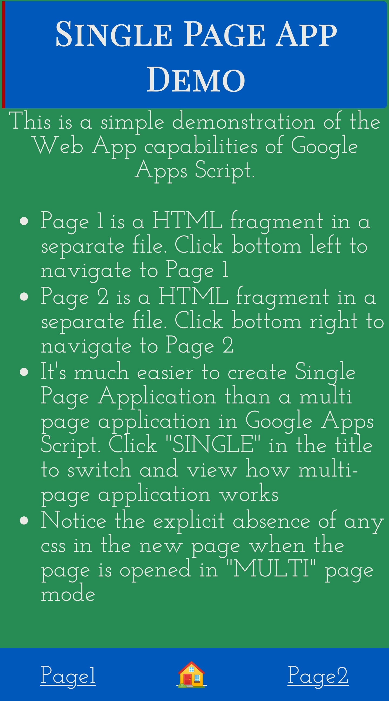

# Apps-script-Multi-page-web-application-demo
Apps script doesn't provide a direct way to access multiple html pages from the browser.This is a sample jquery based multi page web application, where the change handler is used to simulate accessing multiple html web pages dynamically.

See it live [here](https://script.google.com/macros/s/AKfycbwZNBQgmqATRmqwqzgq-enYhc11DyL8rc6_TWj9-8rTjPW3Gd4bkQxk1ydIrJPYNO8s3w/exec)

